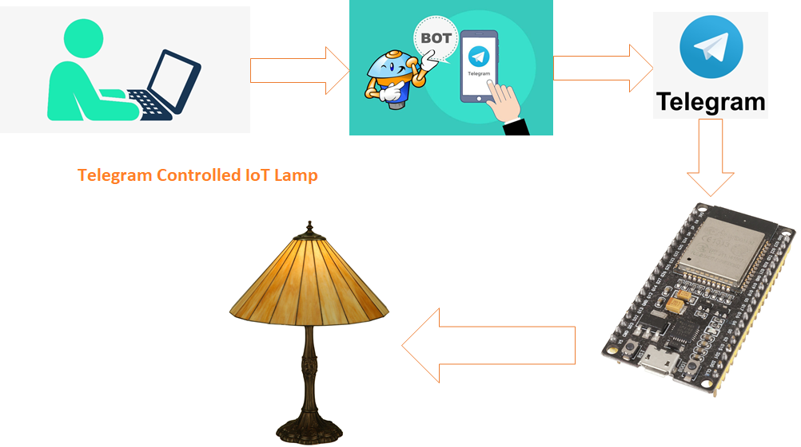

# telegram-controlled-iot-lamp
A Chatbot using Telegram would be controlling home appliances at home

# Block Diagram

# Components
1. ESP32 Board
2. Relay Board
3. 230V AC Lamp

# About me

Madhu Parvathaneni alias MS is a IoT Sloutions Architect at madBlocks IoT Group and Director & Strategist at Madblocks Technologies Pvt Ltd. He has 10+ years of experience in building IoT products 
from prototype stage to production stage. He trained more than 1.8 lakh students and 10K+ faculties across India on various cutting-edge technologies like IoT, Machine Learning, Cloud Computing,
Augmented and Virtual Reality, Robotics, Blockchain etc...

# Purchase the entire project
You can purchase the entire DIY Project Kit (Do-It-Yourself) from our store.  
https://rzp.io/l/maddyProject1

# Get Webinar Certificate
If you want to get webinar certificate, get through the following link  
https://rzp.io/l/MaddyIoT

# Join our Telegram Channel
https://t.me/+3Fk4nGJs6qs5MzJl

# Contact
Reach me on LinkedIn (<a href="https://www.linkedin.com/in/madhupiot/">Maddy</a>)

